<div align="center">

# 🎓 School Attendance System (SAS)

**A role-based school attendance management system with a distributed database architecture.**

Built with PHP · MySQL · Bootstrap 4

[](LICENSE.txt)
[](https://www.php.net/)
[](https://www.mysql.com/)

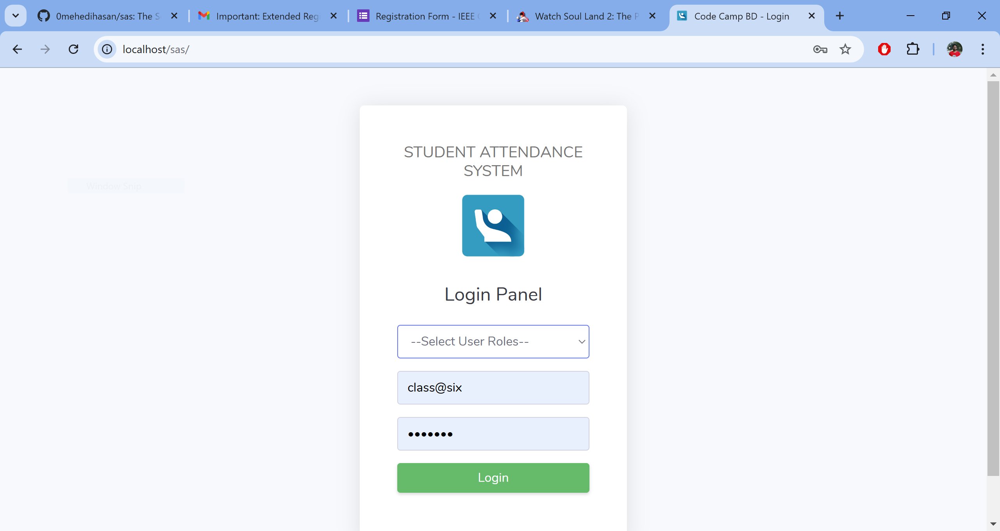

</div>

---

## Table of Contents

- [Overview](#overview)
- [Features](#features)
- [Screenshots](#screenshots)
- [Tech Stack](#tech-stack)
- [Architecture](#architecture)
- [Getting Started](#getting-started)
- [Project Structure](#project-structure)
- [Database Schema](#database-schema)
- [Contributing](#contributing)
- [License](#license)

## Overview

SAS (School Attendance System) is a web-based application that enables schools to manage attendance records through role-based dashboards for **administrators**, **class teachers**, and **students**. The system uses a distributed database architecture — data is partitioned across multiple MySQL databases by grade level — to demonstrate scalable data management.

## Features

### Admin Panel
- Dashboard with school-wide statistics (classes, teachers, students)
- Full CRUD operations for classes, class arms, teachers, and students
- Academic session and term management
- User account creation and management

### Class Teacher Panel
- View roster of students in the assigned class
- Record daily attendance with one-click mark present/absent
- View class-wide and individual student attendance history
- Export attendance records to Excel (.xls)

### Student Panel
- View personal profile and class information
- View personal attendance history
- Download attendance records as Excel files

### System
- Role-based authentication (Admin, Teacher, Student)
- Session management with protected routes
- Distributed database architecture across 4 MySQL databases
- Responsive UI built with Bootstrap 4 and DataTables

## Screenshots

<details>
<summary><strong>Admin Panel</strong></summary>

| Dashboard | Create Class |
|:---------:|:------------:|
| 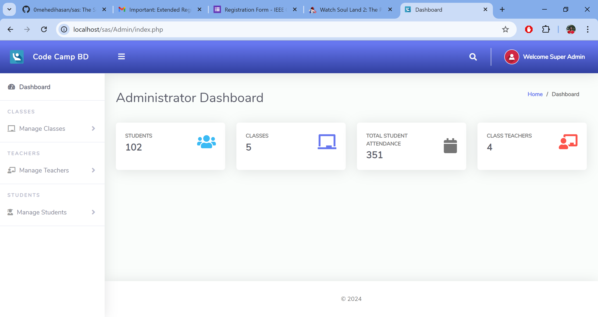 | 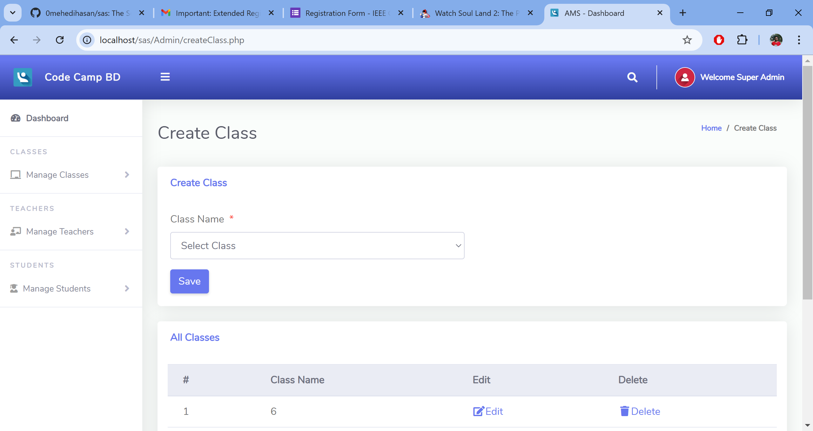 |

| Create Teacher | Create Student |
|:--------------:|:--------------:|
| 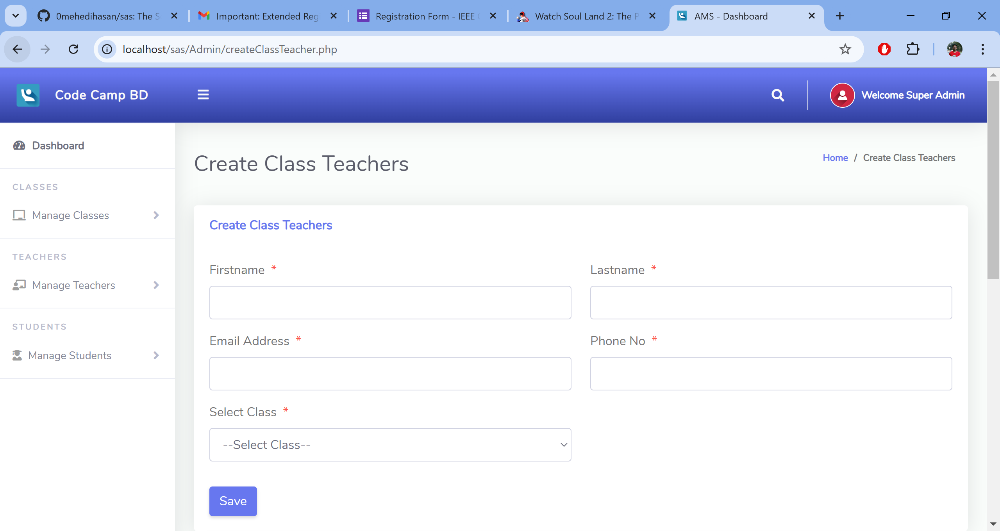 | 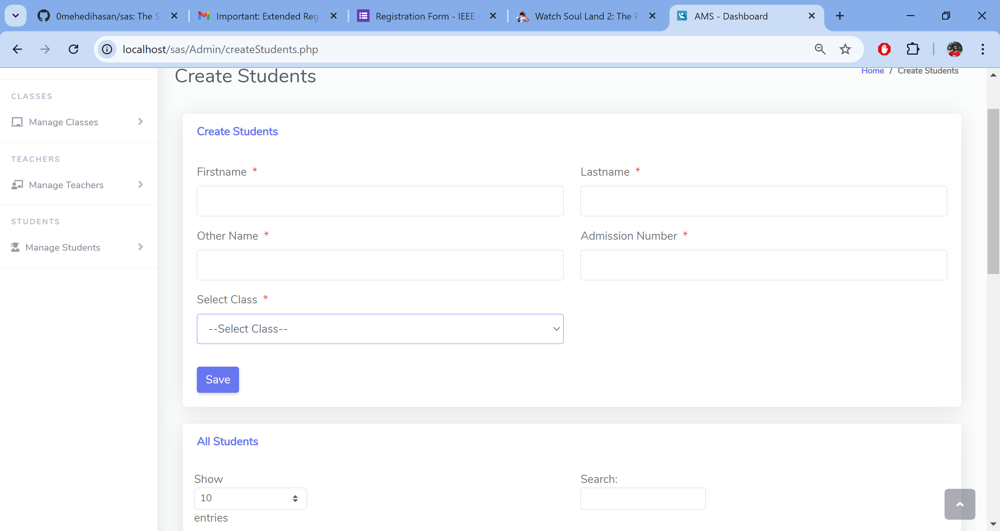 |

</details>

<details>
<summary><strong>Teacher Panel</strong></summary>

| Dashboard | Student List |
|:---------:|:------------:|
| 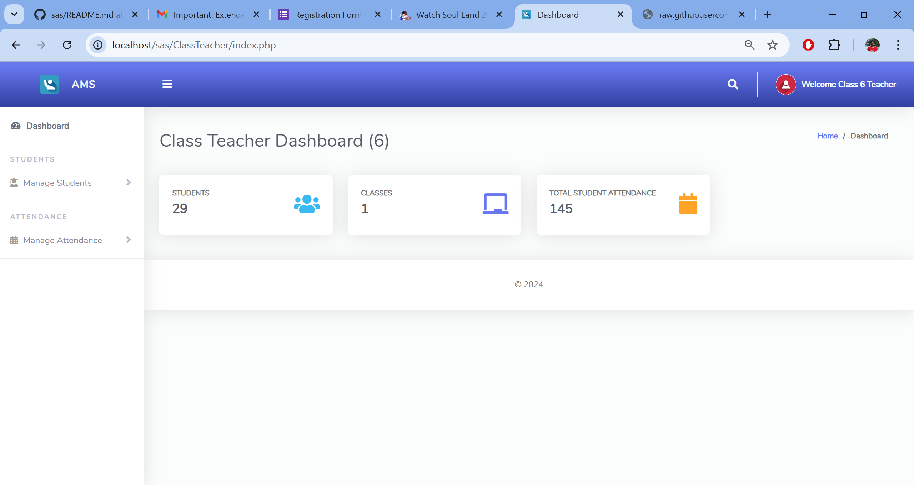 | 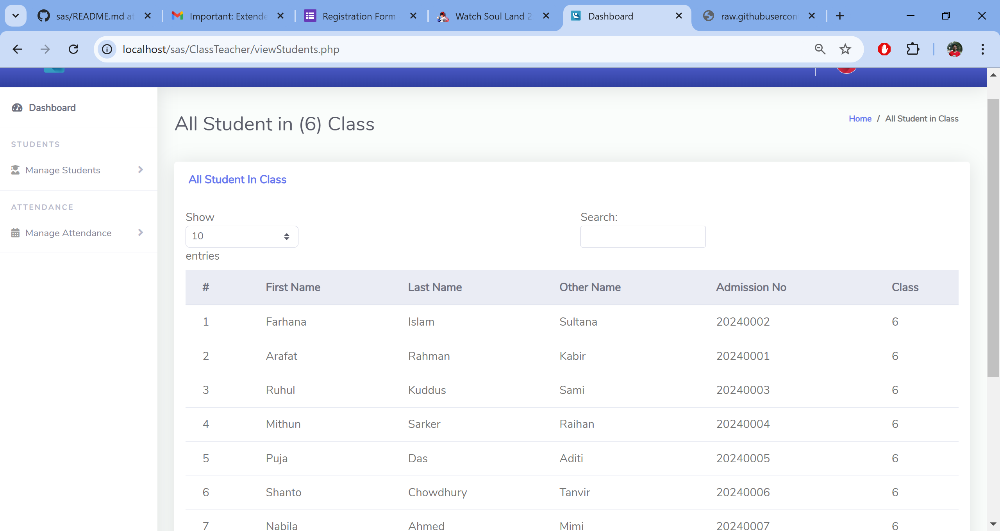 |

| Take Attendance | View Attendance |
|:---------------:|:---------------:|
| 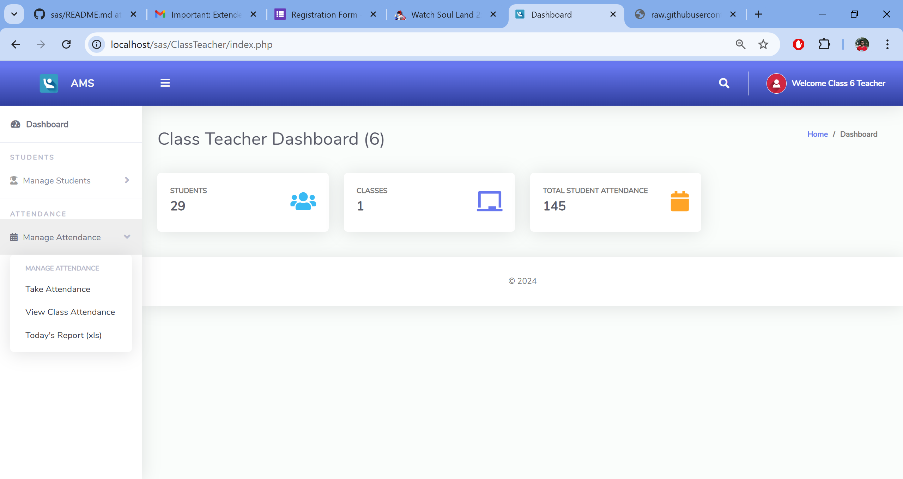 | 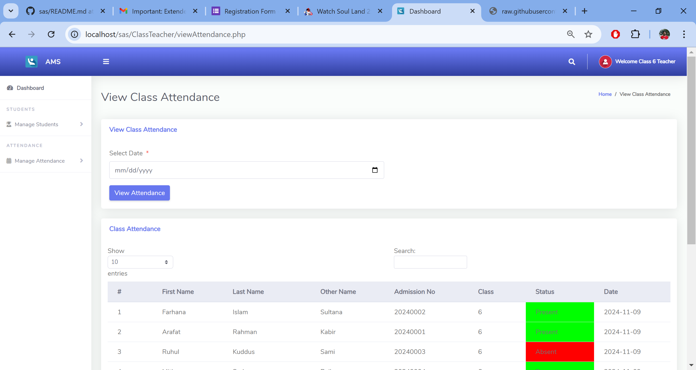 |

| Individual Student Record | Download Report |
|:-------------------------:|:---------------:|
| 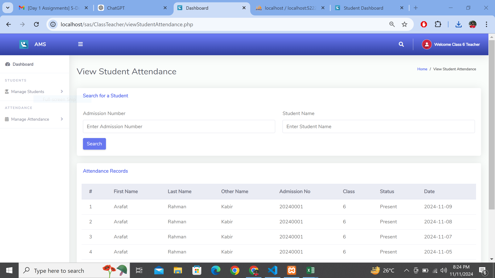 | 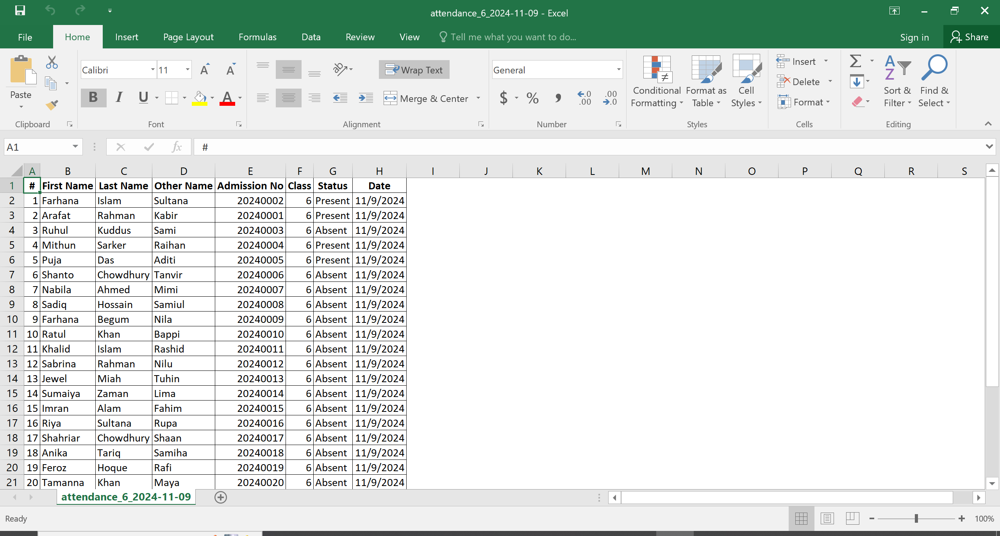 |

</details>

<details>
<summary><strong>Student Panel</strong></summary>

| Dashboard | View Attendance | Download Report |
|:---------:|:---------------:|:---------------:|
| 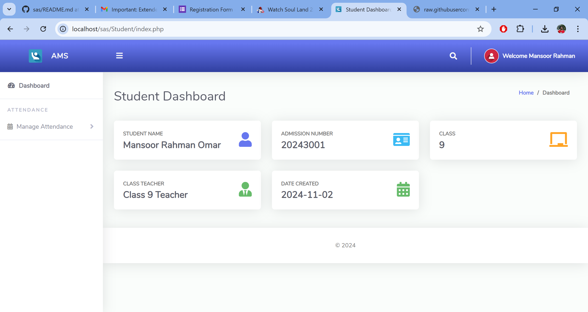 | 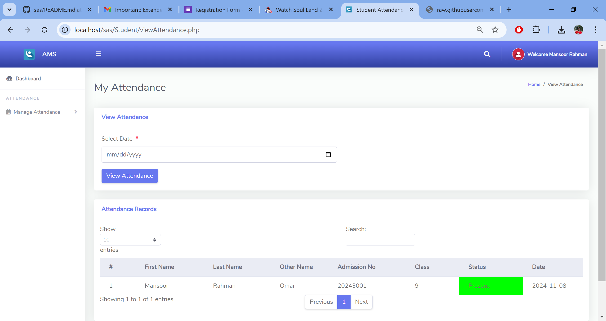 | 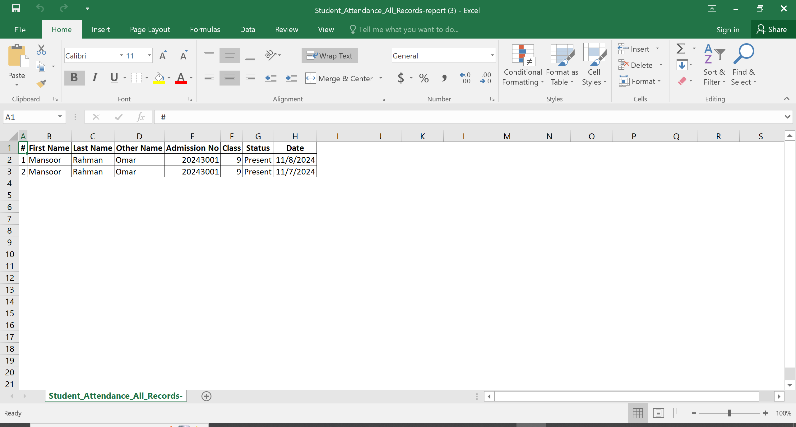 |

</details>

## Tech Stack

| Layer | Technology |
|-------|------------|
| **Frontend** | HTML5, CSS3, JavaScript, [Bootstrap 4](https://getbootstrap.com/), [jQuery](https://jquery.com/), [DataTables](https://datatables.net/), [Font Awesome 5](https://fontawesome.com/) |
| **Backend** | PHP 8.2+ |
| **Database** | MySQL 10.4+ (MariaDB) |
| **Server** | Apache (via [XAMPP](https://www.apachefriends.org/)) |

## Architecture

SAS uses a **Distributed Database Management System (DDBMS)** architecture. Instead of a single database, data is partitioned by grade level across four MySQL databases:

| Database | Scope |
|----------|-------|
| `sas_six` | Class 6 data |
| `sas_seven` | Class 7 data |
| `sas_eight` | Class 8 data |
| `sas_other` | All other classes |

The application establishes connections to all databases at startup and dynamically routes queries to the correct database based on the logged-in user's class assignment.

<details>
<summary><strong>ER Diagram</strong></summary>

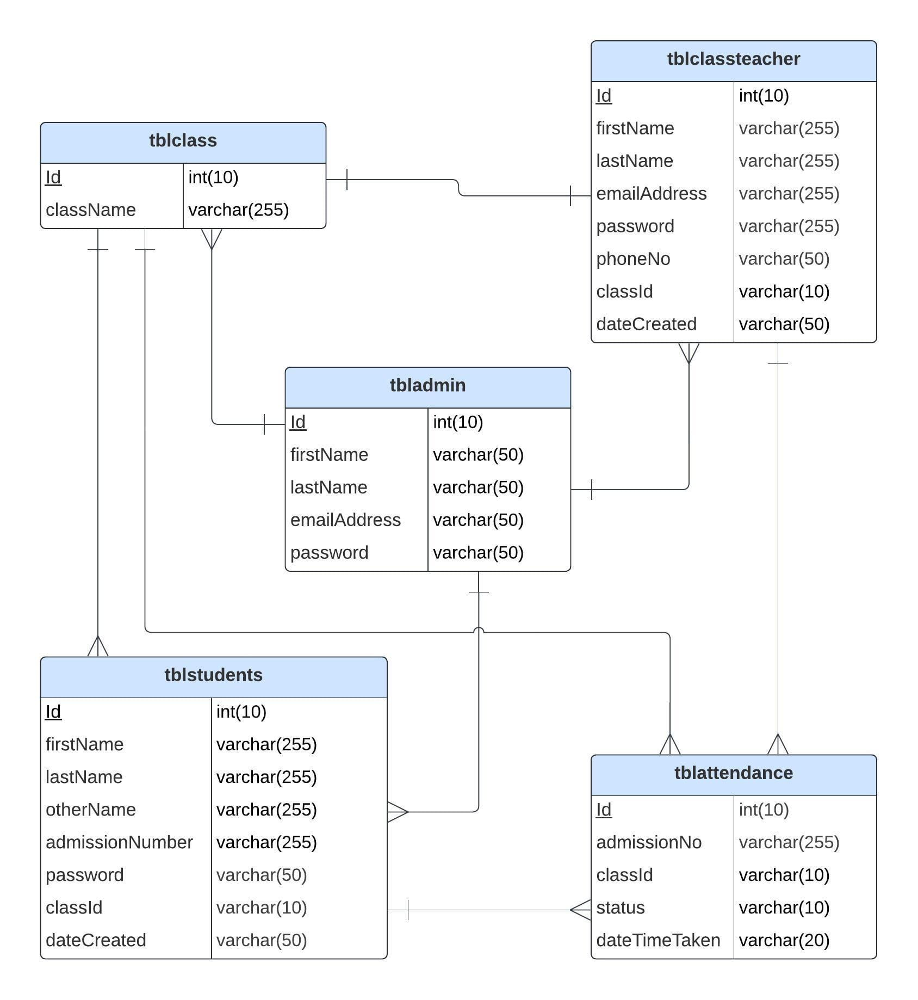

</details>

<details>
<summary><strong>DDBMS Architecture Diagram</strong></summary>

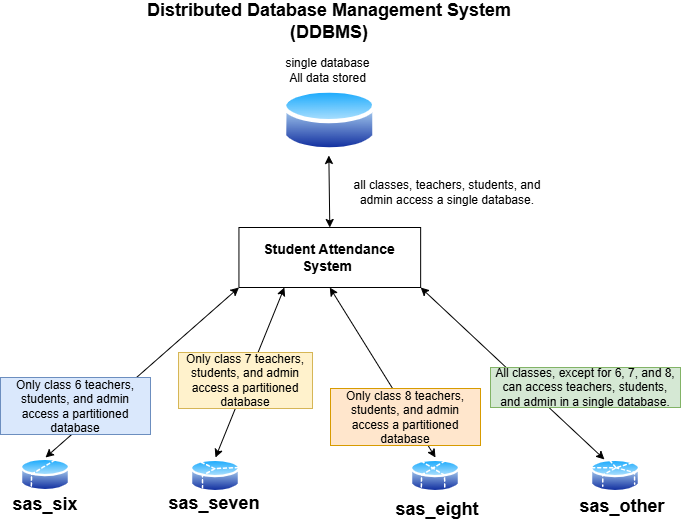

</details>

> **Design Note:** The distributed architecture was chosen over a single centralized database to demonstrate load distribution, data isolation per grade, and improved fault tolerance.

## Getting Started

### Prerequisites

- [XAMPP](https://www.apachefriends.org/) (Apache + MySQL/MariaDB + PHP 8.2+)
- A modern web browser

### Installation

1. **Clone the repository**

   ```bash
   git clone https://github.com/0mehedihasan/sas.git
   ```

2. **Move the project into your XAMPP web root**

   ```bash
   # Example for default XAMPP installation
   cp -r sas /path/to/xampp/htdocs/sas
   ```

3. **Create the databases**

   Open phpMyAdmin (`http://localhost/phpmyadmin`) and create four databases:
   - `sas_six`
   - `sas_seven`
   - `sas_eight`
   - `sas_other`

4. **Import the SQL schema files**

   Import each SQL file from the `DATABASE FILE/` directory into its corresponding database:

   | File | Database |
   |------|----------|
   | `sas_six.sql` | `sas_six` |
   | `sas_seven.sql` | `sas_seven` |
   | `sas_eight.sql` | `sas_eight` |
   | `sas_other.sql` | `sas_other` |

5. **Configure the database connection**

   Edit `Includes/dbcon.php` and update the connection parameters to match your local environment:

   ```php
   $host = "localhost";  // or "localhost:3306" depending on your setup
   $user = "root";
   $pass = "";           // your MySQL password
   ```

6. **Start XAMPP** (Apache and MySQL services) and visit:

   ```
   http://localhost/sas/
   ```

### Demo Credentials

The imported SQL files include sample data with the following demo accounts:

| Role | Login Field | Username / ID | Password |
|------|-------------|---------------|----------|
| Admin | Email | `super@admin` | `admin` |
| Teacher | Email | `class@six` | `pass123` |
| Student | Admission No. | `20240001` | `12345` |

## Project Structure

```
sas/
├── index.php                  # Login page (application entry point)
├── Includes/
│   ├── dbcon.php              # Multi-database connection handler
│   └── session.php            # Session validation
├── Admin/                     # Administrator panel
│   ├── index.php              # Admin dashboard
│   ├── createClass.php        # Manage classes
│   ├── createClassTeacher.php # Manage teachers
│   ├── createStudents.php     # Manage students
│   ├── createUsers.php        # Manage user accounts
│   ├── createSessionTerm.php  # Manage sessions/terms
│   ├── createClassArms.php    # Manage class arms
│   └── Includes/              # Admin layout partials (sidebar, topbar, footer)
├── ClassTeacher/              # Teacher panel
│   ├── index.php              # Teacher dashboard
│   ├── takeAttendance.php     # Record attendance
│   ├── viewAttendance.php     # View class attendance
│   ├── viewStudents.php       # View student roster
│   ├── viewStudentAttendance.php # Individual student records
│   ├── downloadRecord.php     # Export to Excel
│   └── Includes/              # Teacher layout partials
├── Student/                   # Student panel
│   ├── index.php              # Student dashboard
│   ├── viewAttendance.php     # View personal attendance
│   ├── downloadRecord.php     # Export records
│   └── Includes/              # Student layout partials
├── DATABASE FILE/             # SQL schema and sample data
│   ├── sas_six.sql
│   ├── sas_seven.sql
│   ├── sas_eight.sql
│   └── sas_other.sql
├── vendor/                    # Frontend libraries (Bootstrap, jQuery, DataTables, Font Awesome)
├── css/                       # Global stylesheets
├── js/                        # Global scripts
├── scss/                      # SCSS source files
├── font/                      # Web fonts (Nunito)
├── img/                       # Images and logos
├── snap/                      # Application screenshots
├── Proposal,Slides,Reports/   # Project documentation (proposal, slides, ER diagrams)
└── LICENSE.txt                # MIT License
```

## Database Schema

Each of the four databases shares the same schema with these core tables:

| Table | Description |
|-------|-------------|
| `tbladmin` | Administrator accounts |
| `tblclass` | Class/grade definitions |
| `tblclassarms` | Class arm/section divisions |
| `tblclassteacher` | Teacher accounts and class assignments |
| `tblstudents` | Student profiles with admission numbers |
| `tblattendance` | Daily attendance records (status + timestamp) |
| `tblsessionterm` | Academic session and term configuration |
| `tblterm` | Term definitions |

## Contributing

Contributions are welcome! Here's how you can help:

1. **Fork** the repository
2. **Create** a feature branch (`git checkout -b feature/your-feature`)
3. **Commit** your changes (`git commit -m 'Add some feature'`)
4. **Push** to your branch (`git push origin feature/your-feature`)
5. **Open** a Pull Request

### Areas for Contribution

- 🔒 **Security** — Password hashing, prepared statements, input validation
- 🏗️ **Architecture** — MVC refactoring, environment-based configuration
- 🐳 **DevOps** — Docker setup, CI/CD pipeline
- ✅ **Testing** — Automated test suite
- 📱 **UI/UX** — Mobile responsiveness improvements
- 📖 **Documentation** — API docs, inline code documentation

## License

This project is licensed under the **MIT License** — see the [LICENSE.txt](LICENSE.txt) file for details.

---

<div align="center">

**⭐ If you find this project useful, please consider giving it a star!**

Made with ❤️ by [Md. Mehedi Hasan](https://github.com/0mehedihasan)

</div>
